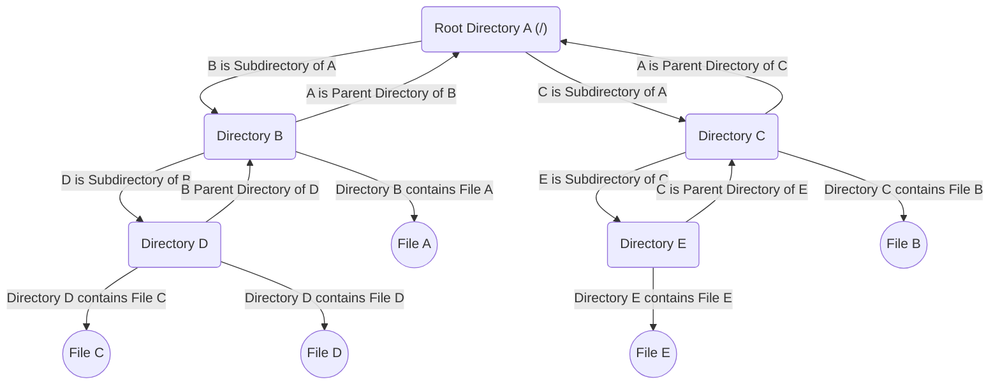

## ***Visual representation of a hierarchy of Direcories and Files***

```mermaid	
graph TB;
    %%Creating Root Directory and its 2 subdirectories B &C
    id1("Root Directory A (/)") -->|B is Subdirectory of A|id2(Directory B);
    id2 -->|A is Parent Directory of B|id1;

    id1 --> |C is Subdirectory of A| id3(Directory C);
    id3 --> |A is Parent Directory of C| id1;

    %%Creating a subdirectory for dicrectory B
    id2 -->|D is Subdirectory of B| id4(Directory D);
    id4 -->|B Parent Directory of D| id2;

    %%Creating A File for Directory B
    id2 -->|Directory B contains File A| id5((File A));

    %%Creating a subdirectory for directory C
    id3 -->|E is Subdirectory of C| id6(Directory E);
    id6 -->|C is Parent Directory of E| id3;

    %%Creating a file for directory C
    id3 -->|Directory C contains File B| id7((File B));

    %%Creating 2 files for Directory D
    id4 -->|Directory D contains File C| id8((File C));
    id4 -->|Directory D contains File D| id9((File D));

    %%Creating a file for Directory E
    id6 -->|Directory E contains File E| id10((File E));
```

 
 

### (To revert back to weather.ipynb notebook, click [here](../weather.ipynb))
